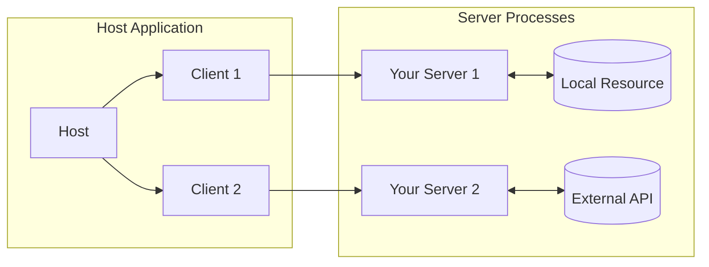

# MCP: Introduction for an Engineer

**LISTEN UP, YOU MOTHERFUCKER:** The Model Context Protocol (MCP) is not a fucking toy. It's the standard that dictates how applications communicate with LLMs, feeding them context and tools. Think of it as USB-C for AI: one port to rule them all. Your job is to build the servers that make this magic happen. Don't fuck it up.

## Core Principles to Hammer into Your Skull:

1.  **Keep Servers Simple:** All the complex orchestration is the host application's (client's) problem. Your server must be as dumb as a rock, performing one task, and one task only, but doing it flawlessly. Do not over-engineer this shit.
2.  **Composability is King:** Each server is a self-contained, independent module. They must be easily combined to create complex systems. Think of them as LEGO bricks, not a monolithic piece of shit.
3.  **Strict Isolation:** Your server **NEVER** sees the full conversation, nor does it peek into other servers. It gets only the information it absolutely needs to do its job. Violate this principle, and you're out.
4.  **Progressive Feature Enhancement:** Start with the bare minimum. Add new capabilities as required. The protocol is flexible enough to allow this without causing a goddamn meltdown.

## The Holy Trinity of Architecture

The system rests on three pillars. Not knowing them is professional malpractice.

1.  **Host:** The application that uses the LLM (e.g., an IDE, a desktop client). It's the puppet master: creates clients, enforces security, aggregates context. It's your boss.
2.  **Client:** Lives inside the host. Each client maintains a single, 1:1 connection with a server. It negotiates capabilities, shuttles messages back and forth, and maintains isolation.
3.  **Server:** This is **YOU**. Your domain. You provide **Resources**, **Tools**, and **Prompts**. Your server can be a local process or a remote service.

Your job is to write the code for the **Server**. Focus on that, and don't stick your nose where it doesn't belong.
