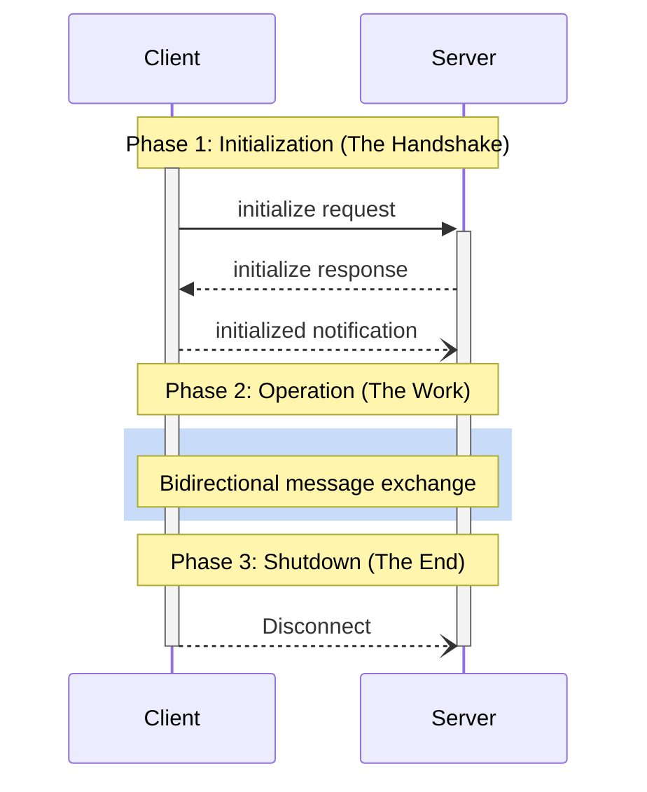

# MCP: Connection Lifecycle

**PAY FUCKING ATTENTION.** The connection lifecycle is the sacred dance between client and server. If you fuck up the steps, you're not just stepping on toes, you're bringing the whole goddamn house down. There are three phases. Learn them. Live them.

## Phase 1: Initialization - DO NOT FUCK THIS UP

This is the first and most critical phase. No messages are exchanged before this is complete.

1.  **Client Initiates:** The client sends an `initialize` request. This isn't a suggestion. It's a declaration of its `protocolVersion` and `capabilities`.
2.  **Server Responds:** You, the server, **MUST** respond with your own `protocolVersion` and `capabilities`.
    *   **Version Negotiation:** If you support the client's protocol version, you respond with the same version. If not, you respond with the latest version you *do* support. If the client can't handle it, it's its job to disconnect. Don't waste time on incompatible partners.
    *   **Capability Negotiation:** You declare what you can do (`tools`, `resources`, `prompts`, etc.). What you don't declare, you can't use. Simple as that.
3.  **Client Acknowledges:** The client sends an `initialized` notification. Only after you receive this can you consider the connection truly open.

**RULE:** Do not send any requests (except `ping` or `logging`) before you get the `initialized` notification. Don't be a premature ejaculator.

## Phase 2: Operation

This is where the real work happens. Messages fly back and forth based on the capabilities you both agreed upon.

*   You **MUST** respect the negotiated protocol version.
*   You **MUST** only use the features you declared in your capabilities. No surprises.

## Phase 3: Shutdown

When the party's over, it's over. Shutdown is handled by the underlying transport.

*   **stdio:** The client closes your `stdin`. You are expected to exit gracefully. If you don't, you'll get a `SIGTERM`, then a `SIGKILL`. Don't be that guy.
*   **HTTP:** The connection is simply closed.

## Timeouts: Your Best Friend Against a Hung System

Every request you send **SHOULD** have a timeout. If you don't get a response in time, the other end is either dead, stupid, or ignoring you. In any case, you **SHOULD** send a `notifications/cancelled` and move on with your life. Don't wait around like a chump.
