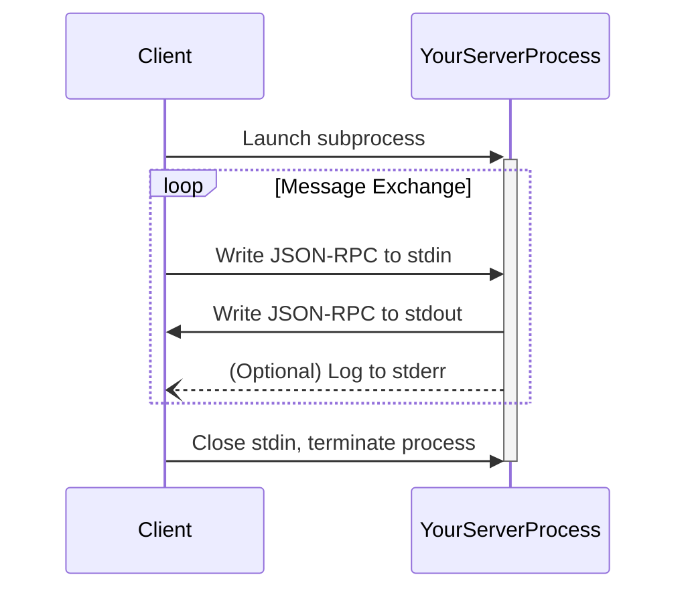

# MCP: Transports

**GET THIS THROUGH YOUR THICK SKULL.** The Transport layer is how your server actually talks to the client. It's the physical (or virtual) wire. All MCP messages are JSON-RPC 2.0, encoded in UTF-8. The transport is responsible for moving these messages.

There are two standard transports. You need to understand both.

## 1. Stdio (Standard Input/Output)

This is the simplest and most common transport for local servers.

*   **How it works:** The client launches your server as a subprocess. It writes requests to your `stdin` and reads responses from your `stdout`.
*   **Your job:**
    *   Read JSON-RPC messages from `stdin`, one per line.
    *   Write JSON-RPC responses to `stdout`, one per line.
    *   You **MUST NOT** write anything to `stdout` that isn't a valid MCP message. Fucking up `stdout` will break the connection.
    *   For logging, you **MAY** write to `stderr`. The client will capture this. This is your only safe place for debug chatter.

**Diagram for the visually inclined:**

## 2. Streamable HTTP

This is for remote servers or more complex local setups. It's more powerful but also more complex.

*   **How it works:** Your server is an independent HTTP server with a single MCP endpoint (e.g., `/mcp`). It handles `POST` and `GET` requests.
*   **Client-to-Server:** The client sends a `POST` request with a single JSON-RPC message in the body.
*   **Server-to-Client:** You can respond in two ways:
    1.  **Single JSON Response:** For simple request-response, you just return `application/json`.
    2.  **Server-Sent Events (SSE):** For streaming responses or server-initiated messages, you return `text/event-stream`. This keeps a connection open for you to push multiple messages.
*   **Server-initiated messages:** The client can also open a long-lived `GET` request to your MCP endpoint, allowing you to send notifications or requests at any time.

### Security Warning for HTTP: DO NOT IGNORE THIS

If you're using HTTP, you are exposing a network port. Attackers will probe it.

1.  **Validate the `Origin` header.** Always. This is your primary defense against DNS rebinding attacks.
2.  **Bind to `localhost` (127.0.0.1)** for local servers. Binding to `0.0.0.0` exposes your server to your entire network. Don't be a dumbass.
3.  **Use HTTPS and Authentication** for any non-trivial remote server. This is not optional.

If you ignore these, you deserve to get hacked.
